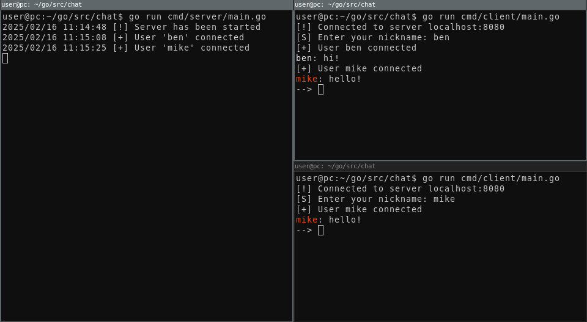

## Simple TCP chat on GOLANG

#### How to run server and client:
* For configure client and server <strong>host</strong> and <strong>port</strong> use <strong>config.go</strong> file.
* For run server: <strong>go run cmd/server/main.go</strong>
* For run client: <strong>go run cmd/client/main.go</strong>

#### Using the client:
* <strong>CTRL+C</strong> or <strong>ESC</strong> for exit

#### Example pic:

